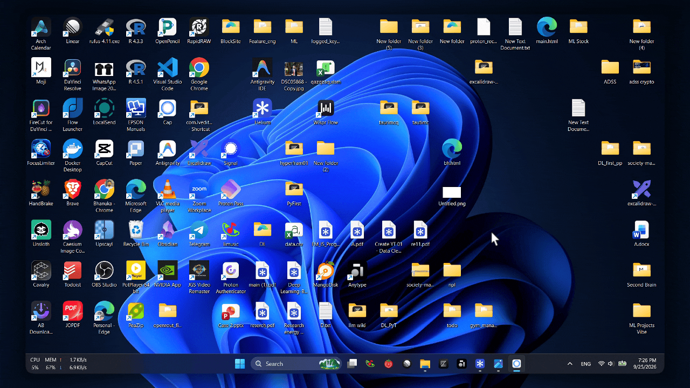
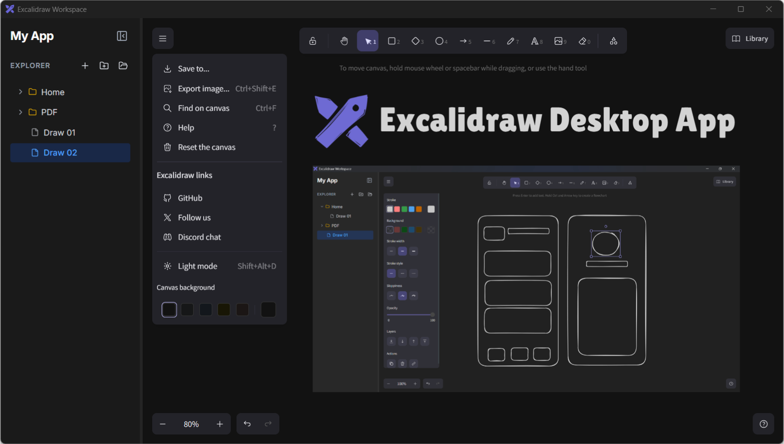
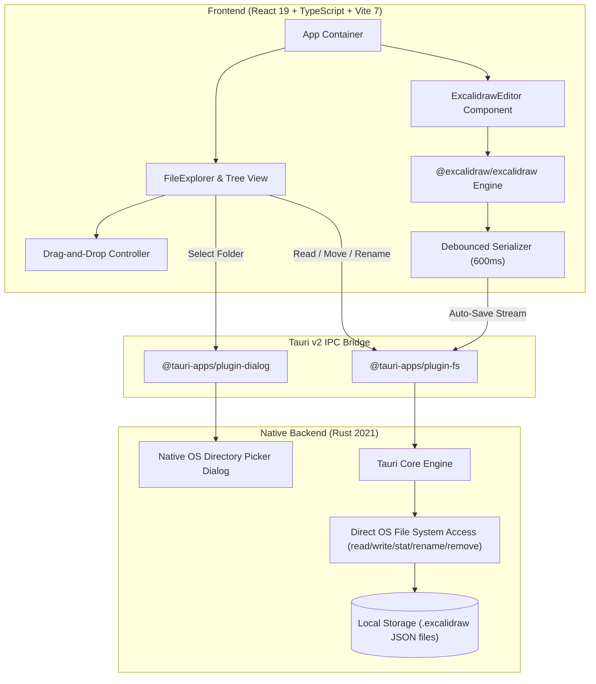

<div align="center">

  

  # Excalidraw Desktop

  <p align="center">
    <strong>A blazing-fast, local-first, offline-native Excalidraw desktop workspace.</strong><br />
    <em>Organize your sketches like code. Store diagrams directly on your filesystem. Zero cloud lock-in. Minimal RAM footprint.</em>
  </p>

  <p align="center">
    <a href="https://github.com/bhanuka01/excalidraw-tauri/stargazers"></a>
    <a href="https://github.com/bhanuka01/excalidraw-tauri/network/members"></a>
    <a href="https://tauri.app/"></a>
    <a href="https://www.rust-lang.org/"></a>
    <a href="https://react.dev/"></a>
    <a href="https://www.typescriptlang.org/"></a>
    <a href="https://tailwindcss.com/"></a>
    <a href="LICENSE"></a>
  </p>

  <p align="center">
    <a href="#-live-demo--preview">Live Demo</a> •
    <a href="#-why-excalidraw-desktop">Why This App?</a> •
    <a href="#-key-features">Key Features</a> •
    <a href="#-architecture--engineering-highlights">Architecture</a> •
    <a href="#-benchmarks--comparison">Benchmarks</a> •
    <a href="#-getting-started">Installation</a> •
    <a href="#-keyboard-shortcuts">Shortcuts</a> •
    <a href="#-author">Author</a>
  </p>

</div>

---

## 🎬 Live Demo & Preview

### 📽️ Interactive Desktop Workflow
Watch the fluid workspace navigation, directory tree reorganization, instant file switching, and debounced auto-saving in action:

<div align="center">
  
</div>

<br />

### 🖼️ High-Res Dark Workspace
A developer-centric UI equipped with VS Code-style sidebar navigation and the complete Excalidraw infinite-canvas toolset:

<div align="center">
  
</div>

---

## ⚡ Why Excalidraw Desktop?

[Excalidraw](https://excalidraw.com) is loved by engineers, designers, and system architects worldwide for creating intuitive hand-drawn diagrams and wireframes. However, existing options have trade-offs:

1. **The Web Version**: Requires manual exporting/importing of `.excalidraw` files or relying on cloud syncing with third-party accounts.
2. **Electron-based Desktop Wrappers**: Bundle an entire Chromium runtime + Node.js instance, casually eating **500MB to 1GB+ of RAM** just to edit a few vector shapes.

### 💡 The Solution: Local-First Rust + React Desktop Architecture
**Excalidraw Desktop** combines the best of both worlds:
- 🦀 **Powered by Tauri v2 & Rust**: Leverages your OS's native webview engine, yielding a tiny memory footprint (~30–50MB RAM) and instantaneous cold starts.
- 📁 **File System First**: Point the app at any directory on your computer (e.g., your project's `docs/architecture` folder or an Obsidian vault). Your diagrams live locally as standard, version-controllable `.excalidraw` JSON files.
- 🛡️ **100% Offline & Private**: Zero telemetry, zero external trackers, and no mandatory cloud accounts. What happens on your machine stays on your machine.

---

## ✨ Key Features

| Feature | Description |
| :--- | :--- |
| 🗂️ **VS Code-Style Workspace** | Select any folder on your machine as an active workspace. Persisted automatically between app launches. |
| 🌲 **Recursive Tree Explorer** | Browse complex directory hierarchies with deep folder nesting, collapse/expand toggles, and item counts. |
| 🖱️ **Full Drag & Drop Reorganization** | Drag and drop diagrams and subfolders anywhere in your file tree to reorganize effortlessly on disk. |
| 💾 **Debounced Native Auto-Save** | Changes serialize in real-time with an intelligent 600ms debounce directly to your drive via Rust native FS APIs. |
| 🔒 **Flush-on-Switch Guarantee** | Safely flushes pending changes when switching files or closing the window, eliminating data loss. |
| ➕ **Auto-Sequential Naming** | Click `+` to instantly create `draw-1.excalidraw`, `draw-2.excalidraw`, etc., dynamically avoiding collisions. |
| ✏️ **Inline File & Folder Operations** | Create folders, rename drawings inline with validation, or delete with native dialog confirmation. |
| 📐 **Resizable & Collapsible Sidebar** | Smooth cursor-based pane resizing with bounds clamping (150px–800px) and a one-click hide/reveal toggle. |
| 🎨 **Full Excalidraw Toolset** | Freehand drawing, geometric shapes, arrows, connectors, text, library packages, and custom color palettes. |
| 📤 **Multi-Format Export** | Export any canvas or selected elements directly to **PNG**, **SVG**, or copy vector graphics to clipboard. |
| 🌙 **Modern Obsidian Dark Theme** | Styled with Tailwind CSS v4 and Lucide React icons for a clean, distraction-free visual experience. |

---

## 📊 Benchmarks & Comparison

How does Excalidraw Desktop compare to traditional desktop diagramming tools?

| Metric / Capability | 🚀 Excalidraw Tauri (This App) | 🐌 Electron Wrappers | 🌐 Web App (Browser) |
| :--- | :---: | :---: | :---: |
| **Idle Memory (RAM)** | **~35 MB – 60 MB** | 450 MB – 900 MB | 250 MB – 500 MB (per tab) |
| **Installer Size** | **~10 MB – 15 MB** | 120 MB – 250 MB | N/A |
| **Cold Startup Time** | **< 350 ms** | 2.5 s – 5.0 s | Network Dependent |
| **Local File System I/O** | **Direct Native Rust Plugin** | Node.js `fs` | Browser sandbox / File System API |
| **Multi-File Workspace** | **Built-in Tree Explorer** | Rare / Custom plugin | No (Single file / Cloud) |
| **Drag & Drop Files** | **Native Disk Reorganization** | Partial | No |
| **Offline Privacy** | **100% Air-Gapped & Local** | Often phones home | Cloud / Cookies / Tracking |

---

## 🏗️ Architecture & Engineering Highlights

Excalidraw Desktop is built on a high-performance decoupled architecture connecting a modern React 19 UI with a hardened Rust backend:



### 🧠 Core Engineering Principles:
- **Zero UI Stuttering**: File operations (file stat, directory traversal, disk read/write) run asynchronously across non-blocking threads to keep the 60FPS canvas buttery smooth.
- **Robust Path Normalization**: Cross-platform path sanitation handles Windows backslashes (`\`) and Unix forward slashes (`/`) transparently without broken tree lookups.
- **Controlled Remount Lifecycle**: Uses dynamic React keys on the editor component to ensure memory is released cleanly when hopping across diagrams without state pollution.

---

## 🛠️ Tech Stack

### Client & Canvas
- **[React 19](https://react.dev/)** – Cutting-edge concurrent UI rendering.
- **[@excalidraw/excalidraw](https://github.com/excalidraw/excalidraw)** – Industry-standard virtual whiteboard engine.
- **[TypeScript 5.8](https://www.typescriptlang.org/)** – Strict end-to-end type safety.
- **[Tailwind CSS v4](https://tailwindcss.com/)** – Next-gen utility-first CSS engine with `@tailwindcss/vite`.
- **[Vite 7](https://vite.dev/)** – Lightning-fast HMR and bundle compilation.
- **[Lucide React](https://lucide.dev/)** – Crisp developer iconography.

### Desktop Backend & Native Layer
- **[Tauri v2](https://tauri.app/)** – Multi-platform desktop runtime built with security and efficiency in mind.
- **[Rust](https://www.rust-lang.org/)** – Memory-safe, high-speed systems language executing native operations.
- **Plugins**: `@tauri-apps/plugin-fs`, `@tauri-apps/plugin-dialog`, `@tauri-apps/plugin-opener`.

---

## 🚀 Getting Started

Follow these steps to set up and run Excalidraw Desktop locally on your machine.

### Prerequisites
1. **Node.js**: `v18.0.0` or higher ([Download Node.js](https://nodejs.org/))
2. **Rust & Cargo**: Latest stable toolchain ([Install Rust](https://www.rust-lang.org/tools/install))
3. **OS Build Tools**:
   - **Windows**: Microsoft C++ Build Tools or Visual Studio with Desktop development with C++.
   - **macOS**: Xcode Command Line Tools (`xcode-select --install`).
   - **Linux**: `libwebkit2gtk-4.1-dev`, `build-essential`, `curl`, `wget`, `file`, `libssl-dev`, `libgtk-3-dev`.

### 1. Clone the Repository
```bash
git clone https://github.com/bhanuka01/excalidraw-tauri.git
cd excalidraw-tauri
```

### 2. Install Dependencies
```bash
npm install
```

### 3. Launch Development Mode
Starts the Vite dev server and opens the native Tauri window with full Hot Module Replacement (HMR):
```bash
npm run tauri dev
```

### 4. Build Production Release
Compiles the optimized Rust binary and bundles an installer for your operating system:
```bash
npm run tauri build
```
The compiled binaries will be output to:
- **Windows**: `src-tauri/target/release/bundle/msi/` or `nsis/` (`.exe` / `.msi`)
- **macOS**: `src-tauri/target/release/bundle/dmg/` (`.dmg` / `.app`)
- **Linux**: `src-tauri/target/release/bundle/deb/` or `appimage/` (`.deb` / `.AppImage`)

---

## 📂 File System Format

All files created and managed by Excalidraw Desktop adhere strictly to the open **Excalidraw schema specification**:

```json
{
  "type": "excalidraw",
  "version": 2,
  "source": "excalidraw-tauri",
  "elements": [
    {
      "id": "e_abc123",
      "type": "rectangle",
      "x": 200,
      "y": 150,
      "width": 120,
      "height": 80,
      "strokeColor": "#1e1e1e",
      "backgroundColor": "#a5d8ff",
      "fillStyle": "hachure",
      "roughness": 1
    }
  ],
  "appState": {
    "viewBackgroundColor": "#121212"
  },
  "files": {}
}
```

> [!TIP]
> Because files are saved as standard JSON, you can track their diffs in **Git**, share them with teammates, or open them on [excalidraw.com](https://excalidraw.com) at any time!

---

## ⌨️ Keyboard Shortcuts

Speed up your design workflow with built-in shortcuts:

| Action | Shortcut |
| :--- | :--- |
| **Selection Tool** | `V` or `1` |
| **Rectangle** | `R` or `2` |
| **Diamond** | `D` or `3` |
| **Ellipse** | `O` or `4` |
| **Arrow** | `A` or `5` |
| **Line** | `L` or `6` |
| **Draw / Freehand Pen** | `P` or `7` |
| **Text** | `T` or `8` |
| **Eraser** | `E` or `0` |
| **Export Image** | `Ctrl + Shift + E` / `Cmd + Shift + E` |
| **Search on Canvas** | `Ctrl + F` / `Cmd + F` |
| **Zoom In / Zoom Out** | `Ctrl + +` / `Ctrl + -` |
| **Toggle Dark/Light Mode** | `Shift + Alt + D` |

---

## 🗺️ Roadmap

- [x] Full native workspace directory mounting
- [x] Recursive folder tree with drag & drop reordering
- [x] Debounced native filesystem auto-save & flush on switch
- [x] Resizable and collapsible sidebar navigation
- [ ] Multi-tab canvas switching for active drawings
- [ ] Built-in `.excalidrawlib` library bundle manager
- [ ] Export directly to PDF
- [ ] Split-view dual diagram comparison
- [ ] Auto-updater integration via Tauri updater plugin

---

## 🤝 Contributing

Contributions, issues, and feature requests are very welcome!

1. Fork the project (`https://github.com/bhanuka01/excalidraw-tauri/fork`)
2. Create your feature branch (`git checkout -b feature/AmazingFeature`)
3. Commit your changes (`git commit -m 'feat: add AmazingFeature'`)
4. Push to the branch (`git push origin feature/AmazingFeature`)
5. Open a Pull Request

---

## 📄 License

This project is open-source and licensed under the [MIT License](LICENSE).

---

## 👨‍💻 Author

Crafted with ❤️ and performance engineering by **Bhanuka Dilshan**:

- **GitHub**: [@bhanuka01](https://github.com/bhanuka01)
- **Email**: [bhanukadilshan01@gmail.com](mailto:bhanukadilshan01@gmail.com)
- **Repository**: [https://github.com/bhanuka01/excalidraw-tauri](https://github.com/bhanuka01/excalidraw-tauri)

<div align="center">
  <sub>⭐ If you find this project useful, please consider giving it a star on GitHub! ⭐</sub>
</div>
